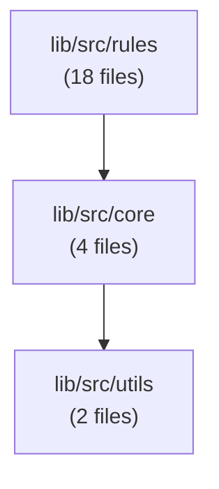

# Dart Sentinel

Static analysis, metrics, and architecture enforcement tool for Dart/Flutter projects.

Requires Dart SDK `^3.9.0` (works standalone or inside any Flutter project).

## Where do I start?

| You want... | Go to |
|---|---|
| Diagnostics inline in VS Code / Android Studio / IntelliJ, no CLI | [IDE Plugin](#ide-plugin-analysis-server) |
| Your architecture enforced automatically inside **Claude Code** | [Claude Code Hooks](#claude-code-hooks) |
| Copilot, Cursor, or another AI agent to know your architecture via MCP | [MCP Server](#mcp-server-ai-agent-integration) |
| A step-by-step guide to wire Sentinel into a new AI-assisted project | [Starting a Project with AI Agents](#starting-a-project-with-ai-agents) |
| Just the CLI, run manually or in CI | [Installation](#installation) → [Usage](#usage) |
| A ready-made `analyzer.yaml` for your architecture (BLoC, Riverpod, Clean, etc.) | [Architecture Templates](#architecture-templates) |

## Table of Contents

- [IDE Plugin (Analysis Server)](#ide-plugin-analysis-server)
- [Claude Code Hooks](#claude-code-hooks)
- [Installation](#installation)
- [Usage](#usage)
- [Configuration](#configuration)
- [Rules](#rules)
- [Analysis Tools](#analysis-tools) (impact analysis, dependency map, migrations, l10n, ratchet mode)
- [CI Integration](#ci-integration)
- [Starting a Project with AI Agents](#starting-a-project-with-ai-agents)
- [MCP Server (AI Agent Integration)](#mcp-server-ai-agent-integration)
- [Programmatic Usage](#programmatic-usage)
- [Package Structure](#package-structure)
- [Architecture Templates](#architecture-templates)

## VS Code Extension

Install the companion extension for inline diagnostics, quick navigation, and a summary dashboard directly in your editor:

**[Dart Sentinel — VS Code Marketplace](https://marketplace.visualstudio.com/items?itemName=LuanCesar.dart-sentinel)**

## IDE Plugin (Analysis Server)

Dart Sentinel integrates with the Dart analysis server to show diagnostics in real-time directly in your IDE — squiggly underlines, hover messages, and **Ctrl+.** quick fixes. No CLI needed.

### Setup

1. Add `dart_sentinel` via global activation:

```bash
dart pub global activate dart_sentinel
```

2. Enable the plugin in your `analysis_options.yaml`:

```yaml
plugins:
  - dart_sentinel
```

3. Restart the Dart analysis server (VS Code: `Dart: Restart Analysis Server`).

### What you get

- **Real-time diagnostics** — warnings and infos appear as you type, no save required
- **Quick fixes (Ctrl+.)** — available for: empty catch blocks (add `rethrow`), dead TODOs (remove), redundant comments (remove), async safety (add `mounted` check)
- Works in **VS Code**, **Android Studio**, **IntelliJ**, and any editor using the Dart analysis server

### Plugin rules

All single-file rules run as analysis server plugins:

| Rule | Severity | Quick Fix |
|------|----------|-----------|
| `empty_catch` | warning | Add `rethrow` |
| `dead_todo` | info | Remove comment |
| `redundant_comment` | info | Remove comment |
| `async_safety` | warning | Add `mounted` check |
| `dispose_check` | warning | — |
| `generic_naming` | warning | — |
| `verbose_logging` | info | — |
| `single_method_class` | info | — |
| `passthrough_function` | info | — |
| `lazy_null_check` | warning | — |
| `sentinel_complexity` | warning | — |
| `build_complexity` | warning | — |

> **Note:** Cross-file rules (dead-files, dead-exports, import-cycles) and config-dependent rules (feature-isolation, layer-dependency, banned-imports) are only available via the CLI.

## Claude Code Hooks

For projects using Claude Code, Dart Sentinel can enforce your architecture
automatically — no MCP tool calls to remember, no manual CLI runs.

You need an `analyzer.yaml` first — see [Configuration](#configuration) to
write one by hand, or [Architecture Templates](#architecture-templates) to
start from one matching your stack (BLoC, Riverpod, Clean Architecture,
etc.). Then, from your project root:

```bash
dart_sentinel setup-hooks
```

This writes two hooks into `.claude/settings.json`:

- **PostToolUse** (`hook-edit`) — after every `Edit`/`Write` on a `.dart`
  file, Sentinel analyzes just that file. If it introduces an error-severity
  violation, Claude sees it immediately and has to fix it before continuing —
  the same way a compile error would stop it.
- **Stop** (`hook-stop`) — when Claude finishes responding, Sentinel runs a
  full project scan and compares it against `.dart_sentinel/baseline.json`
  (Ratchet Mode). If anything regressed, Claude is told exactly what and has
  to keep working. If nothing regressed, you get a one-line summary of what
  was caught and fixed during the session.

Requires `analyzer.yaml` to already exist (`setup-hooks` will tell you if it
doesn't). Accept a new baseline explicitly once you're happy with the current
state:

```bash
dart_sentinel --save-baseline
```

## Installation

Install globally:

```bash
dart pub global activate dart_sentinel
```

Ensure `~/.pub-cache/bin` is in your `PATH`. Then run from any Dart/Flutter project root:

```bash
dart_sentinel
```

> **Do not add `dart_sentinel` to your project's `pubspec.yaml`.** It uses `package:analyzer` internally at specific versions that will conflict with your project's own analyzer dependency. Global activation avoids this entirely.

## Usage

```bash
# Run all rules
dart_sentinel

# Architecture rules only
dart_sentinel -o arch

# Dead code only
dart_sentinel -o dead

# Metrics only
dart_sentinel -o metrics

# Lint rules only
dart_sentinel -o lint

# AI slop detection
dart_sentinel -o slop

# Testing enforcement
dart_sentinel -o testing

# JSON output (for CI)
dart_sentinel -f json

# Markdown output (for PR comments)
dart_sentinel -f markdown

# Specify project path
dart_sentinel -p /path/to/project

# Change impact analysis — hot spots
dart_sentinel -o impact

# Blast radius of specific files
dart_sentinel -o impact --files lib/src/core/issue.dart

# Dependency map (text summary)
dart_sentinel -o map

# Dependency map (Mermaid diagram)
dart_sentinel -o map -f mermaid

# Migration progress for banned-symbols
dart_sentinel -o migrations

# Ratchet mode — save baseline
dart_sentinel --save-baseline

# Ratchet mode — CI check (fails if regressions)
dart_sentinel --check-baseline

# Generate AI integration files
dart_sentinel generate-ai-config --tool copilot
dart_sentinel generate-ai-config --tool cursor
dart_sentinel generate-ai-config --tool all
```

## Configuration

Create an `analyzer.yaml` file at the root of your project:

```yaml
# Files to exclude (globs)
exclude:
  - "**/*.g.dart"
  - "**/*.freezed.dart"
  - "**/*.gr.dart"

# Entrypoints (auto-detected if not specified)
entrypoints:
  - lib/main.dart
  - lib/main_partner_mobile.dart

# Extra directories to scan
extra_scan_dirs:
  - integration_test
  - bin

# Severity per rule
rules:
  dead-files: warning
  banned-imports: error
  banned-symbols: warning
  complexity: warning
  dispose-check: warning
  empty-catch: warning
  generic-naming: warning
  dead-todos: info
  verbose-logging: info
  lazy-null-check: warning

# AI slop rule-specific settings
ai_slop:
  lazy_null_check:
    flag_empty_string: true   # x ?? ""
    flag_zero: true           # x ?? 0
    flag_false: true          # x ?? false
    flag_empty_collection: true # x ?? [] / x ?? {}

# Architecture rules
architecture:
  banned_imports:
    - paths: ["lib/features/**/viewmodel/**"]
      deny: ["package:cloud_firestore/**"]
      message: "ViewModels must not access Firestore directly -- use Services."

  banned_symbols:
    - paths: ["lib/apps/**", "lib/features/**"]
      deny: ["ElevatedButton", "TextButton", "OutlinedButton"]
      suggest: "AppButton"
      message: "Use AppButton from your design system instead of raw Flutter buttons."
    - paths: ["lib/apps/**", "lib/features/**"]
      deny: ["showDialog", "AlertDialog"]
      suggest: "AppDialog.show"
      message: "Use AppDialog.show from your design system."

  layers:
    ui:
      paths: ["lib/features/**", "lib/apps/**"]
      can_depend_on: ["service", "core", "domain"]
    service:
      paths: ["lib/services/**"]
      can_depend_on: ["repository", "core", "domain"]
    repository:
      paths: ["lib/repositories/**"]
      can_depend_on: ["data", "core", "domain"]

  feature_isolation:
    enabled: true
    paths: ["lib/features/*/"]
    allow_shared:
      - "lib/core/**"
      - "lib/domain/**"
      - "lib/services/**"

# Metrics thresholds
metrics:
  cyclomatic_complexity:
    warning: 10
    error: 20
  lines_per_file:
    warning: 300
    error: 600
  lines_per_method:
    warning: 50
    error: 100
  max_parameters:
    warning: 4
    error: 7
  max_nesting:
    warning: 4
    error: 6
  build_method_loc:
    warning: 30
    error: 60
  build_method_branches:
    warning: 3
    error: 6
```

## Rules

### Dead Code
| Rule | Description |
|------|-------------|
| `dead-files` | Detects files unreachable from any entrypoint |
| `dead-exports` | Detects exports that no file imports |

### Architecture
| Rule | Description |
|------|-------------|
| `banned-imports` | Prevents forbidden imports in specific paths |
| `banned-symbols` | Prevents usage of specific symbols/constructors (e.g. enforce Design System) |
| `layer-dependency` | Validates imports respect defined layer boundaries |
| `feature-isolation` | Prevents horizontal coupling between features |
| `import-cycles` | Detects cycles in the import graph |

### Metrics
| Rule | Description |
|------|-------------|
| `complexity` | LOC, cyclomatic complexity, parameters, nesting depth |
| `build-complexity` | LOC and branches in Widget `build()` methods |

### Lint
| Rule | Description |
|------|-------------|
| `dispose-check` | Verifies resources are disposed correctly |
| `async-safety` | Detects `setState`/`context` usage after `await` without `mounted` check |

### AI Slop Detection (`-o slop`)
| Rule | Description |
|------|-------------|
| `empty-catch` | Detects swallowed exceptions: empty catch blocks and catch-and-print-only |
| `dead-todos` | Flags TODO/FIXME/HACK comments without actionable context |
| `generic-naming` | Catches variables/functions with low semantic specificity (`data`, `result`, `handleData`) |
| `redundant-comments` | Detects comments that restate what the code already says |
| `verbose-logging` | Flags excessive consecutive log/print statements |
| `single-method-class` | Suggests plain functions for classes with a single public method |
| `passthrough-function` | Detects functions that only delegate to another with the same arguments |
| `lazy-null-check` | Detects lazy null coalescing (`x ?? ""`, `x ?? 0`, `x ?? []`, `x ?? false`) |

## Analysis Tools

### Change Impact Analysis (`-o impact`)

Analyze the blast radius of file changes — how many files are affected transitively.

```bash
# Show hot spots (files with the most dependents)
dart_sentinel -o impact

# Blast radius of a specific file
dart_sentinel -o impact --files lib/src/core/issue.dart

# JSON output
dart_sentinel -o impact --files lib/src/core/issue.dart -f json
```

Example output:
```
  Hot Spots (highest blast radius):

   32 transitive (25 direct)  lib/src/core/issue.dart
   29 transitive (7 direct)   lib/src/utils/glob_matcher.dart
   28 transitive (15 direct)  lib/src/config/analyzer_config.dart
```

### Dependency Map (`-o map`)

Visualize the module structure and dependencies of your project.

```bash
# Text summary
dart_sentinel -o map

# Mermaid diagram (paste into GitHub PR, Notion, etc.)
dart_sentinel -o map -f mermaid
```

The Mermaid output generates a valid diagram you can render anywhere:



### Migration Tracker (`-o migrations`)

Track gradual migration progress for `banned-symbols` rules. Shows remaining usages per symbol and which files still need updating.

```bash
dart_sentinel -o migrations
dart_sentinel -o migrations -f json
```

Example output:
```
Migration Progress
════════════════════════════════════════════════════════════

ElevatedButton, TextButton → AppButton
  Remaining: 12 usages in 5 files
    ElevatedButton: 8
    TextButton: 4

showDialog → AppDialog.show
  Remaining: 0 usages in 0 files
  ✅ Migration complete!

Total remaining: 12
```

### L10n Scanner (`-o l10n`)

Scan for hardcoded UI strings and check translation coverage across ARB files. Designed to work with AI agents for full-app translation workflows.

```bash
dart_sentinel -o l10n
dart_sentinel -o l10n -f json
```

Example output:
```
  L10n Analysis
  ════════════════════════════════════════════════════════════

  Hardcoded Strings (3):

    lib/src/home_page.dart:42  "Welcome back!"  (Text)
    lib/src/login_page.dart:18  "Sign in"  (ElevatedButton.label)
    lib/src/settings.dart:55  "Dark Mode"  (SwitchListTile.title)

  Translation Coverage:

    Base language: en
    Total keys: 24

    en: 24/24 (100%)
    pt: 22/24 (92%)  (2 missing)
    es: 20/24 (83%)  (4 missing)
```

### Ratchet Mode (CI Baseline Enforcement)

Ensure code quality only improves over time. Save a baseline of issue counts and fail CI if any count increases.

```bash
# Save current state as baseline (commit this file)
dart_sentinel --save-baseline

# CI step: fail if any rule regressed
dart_sentinel --check-baseline
```

The baseline is saved to `.dart_sentinel/baseline.json`. Commit this file to your repo. On each CI run, `--check-baseline` compares current issues against the baseline:

- **Pass**: No rule has more issues than the baseline (improvements are fine)
- **Fail** (exit code 1): Any rule has more issues → regression detected

```yaml
# GitHub Actions
- name: Ratchet check
  run: dart_sentinel --check-baseline
```

## CI Integration

### GitHub Actions

```yaml
- name: Run Dart Sentinel
  run: dart_sentinel -f json > lint_report.json

- name: Check for errors
  run: dart_sentinel  # exit code 1 if there are errors

- name: Ratchet check
  run: dart_sentinel --check-baseline
```

### Pre-commit hook

Add to `.githooks/pre-commit`:

```bash
#!/bin/sh
dart_sentinel -o arch
```

## Starting a Project with AI Agents

This section is a step-by-step guide for using Dart Sentinel as the **architectural backbone** of an AI-assisted Flutter project. The idea is simple: you define the rules once, and the AI agent respects them — without you having to repeat constraints in every prompt.

### 1. Choose a template and create `analyzer.yaml`

Pick the template that matches your architecture (or start with `starter.yaml`):

```bash
# Example: Clean Architecture + BLoC
cp example/templates/clean_bloc.yaml analyzer.yaml
```

This file is the **single source of truth** for your architecture. Edit it to match your project's folder structure, layer boundaries, and conventions. The AI agent will read this file (via MCP) to understand what is allowed.

### 2. Configure the MCP server

Create `.vscode/mcp.json` so the AI agent can talk to Dart Sentinel:

```json
{
  "servers": {
    "dart-sentinel": {
      "type": "stdio",
      "command": "dart_sentinel",
      "args": ["--mcp"]
    }
  }
}
```

> For **Cursor**, add to `.cursor/mcp.json` with `{"mcpServers": {"dart-sentinel": {"command": "dart_sentinel", "args": ["--mcp"]}}}`. For **Claude Code**, the command is the same: `dart_sentinel --mcp`.

### 3. Create instruction files for the AI agent

AI agents (Copilot, Cursor, Claude Code) read markdown instruction files to understand your project. Below is what to put in each one.

#### `.github/copilot-instructions.md` (GitHub Copilot)

This is the main instruction file for Copilot. Put your project-wide conventions here:

```markdown
# Project Instructions

## Architecture
This project follows Clean Architecture + BLoC (feature-first).
Architecture rules are enforced by Dart Sentinel (`analyzer.yaml`).

Before writing code:
1. Read the architecture rules: use the `get_architecture` tool from dart-sentinel MCP
2. Check if an import is allowed: use the `check_import` tool before adding any cross-layer import
3. After generating a file: use `analyze_file` to verify no violations

## Folder Structure
- `lib/core/` — shared infrastructure (DI, error handling, network)
- `lib/features/<name>/domain/` — entities, repository interfaces, use cases (NO Flutter imports)
- `lib/features/<name>/data/` — models, data sources, repository implementations (NO Flutter imports)
- `lib/features/<name>/presentation/` — pages, widgets, BLoCs
- `lib/shared/` — reusable widgets and helpers

## Conventions
- BLoCs depend on UseCases only, never on Data layer directly
- Domain layer is pure Dart — no Flutter, no external packages
- Every feature is isolated — no cross-feature imports (use core/ or shared/)
- Use AppButton, AppDialog instead of raw Flutter widgets (enforced by banned-symbols)
- Dispose all StreamSubscriptions, TextEditingControllers, AnimationControllers
- No empty catch blocks — always handle or rethrow
- No setState/context usage after await without mounted check

## After generating code
Always run `analyze_file` on new/modified files to check for:
- Layer violations
- Banned imports
- Complexity issues
- Missing dispose calls
```

#### `.cursorrules` (Cursor)

Same content as above. Cursor reads `.cursorrules` from the project root.

#### `CLAUDE.md` (Claude Code)

Same content as above. Claude Code reads `CLAUDE.md` from the project root.

#### `.instructions.md` / `.copilot-instructions.md` (folder-scoped)

You can also place scoped instructions in specific folders. These override or complement global instructions:

```markdown
<!-- lib/features/.instructions.md -->
# Feature Rules
- Each feature must be self-contained (domain + data + presentation)
- No imports from other features — use core/ or shared/ for shared code
- BLoCs go in presentation/bloc/, one BLoC per feature flow
```

```markdown
<!-- lib/core/.instructions.md -->
# Core Rules  
- This folder has no dependencies on features/ or shared/
- Only pure Dart and infrastructure packages allowed
```

### 4. Typical AI workflow

Once everything is set up, the cycle looks like this:

```
You write a prompt
  → AI reads copilot-instructions.md (knows the rules)
  → AI calls get_architecture (reads analyzer.yaml via MCP)
  → AI generates code
  → AI calls analyze_file (Dart Sentinel checks for violations)
  → AI fixes any violations
  → You get clean, architecture-compliant code
```

**Example prompt:**
> Create the auth feature with login use case, Firebase data source, and login page with BLoC.

The agent will:
1. Call `get_architecture` to understand layers and boundaries
2. Create `lib/features/auth/domain/entities/user.dart`
3. Create `lib/features/auth/domain/repositories/auth_repository.dart` (interface)
4. Create `lib/features/auth/domain/usecases/login_usecase.dart`
5. Create `lib/features/auth/data/models/user_model.dart`
6. Create `lib/features/auth/data/datasources/firebase_auth_datasource.dart`
7. Create `lib/features/auth/data/repositories/auth_repository_impl.dart`
8. Create `lib/features/auth/presentation/bloc/auth_bloc.dart`
9. Create `lib/features/auth/presentation/pages/login_page.dart`
10. Call `analyze_file` on each file → fix any violations automatically

### 5. CI integration with ratchet mode

Lock in the quality bar so it never goes down:

```bash
# Save current baseline (commit .dart_sentinel/baseline.json)
dart_sentinel --save-baseline

# CI step — fails if any rule has more issues than baseline
dart_sentinel --check-baseline
```

This means the AI can't introduce architectural regressions even if it doesn't call the MCP tools.

### Quick reference: which file does what

| File | Who reads it | Purpose |
|------|-------------|---------|
| `analyzer.yaml` | Dart Sentinel (+ AI via MCP) | Architecture rules, layers, banned imports, metrics thresholds |
| `.vscode/mcp.json` | VS Code / Copilot | MCP server connection config |
| `.github/copilot-instructions.md` | GitHub Copilot | Project conventions in natural language |
| `.cursorrules` | Cursor | Project conventions in natural language |
| `CLAUDE.md` | Claude Code | Project conventions in natural language |
| `.instructions.md` | Copilot (folder-scoped) | Per-folder overrides and context |
| `.dart_sentinel/baseline.json` | Dart Sentinel CLI | Ratchet baseline for CI |

### Tips

- **Keep `copilot-instructions.md` short and actionable.** The AI has limited context — bullet points > paragraphs.
- **Always mention the MCP tools by name** (`get_architecture`, `check_import`, `analyze_file`) so the agent knows they exist.
- **Use templates as starting points.** Customize `analyzer.yaml` to match your actual folder structure — templates are guides, not gospel.
- **Run `dart_sentinel` yourself periodically.** The AI agent won't always catch everything via MCP. A full scan catches cross-file issues (dead files, import cycles) that single-file analysis misses.
- **Combine with `--save-baseline`** after big cleanup efforts to lock in the improvement.

---

## MCP Server (AI Agent Integration)

Dart Sentinel exposes an MCP (Model Context Protocol) server so AI coding assistants like GitHub Copilot, Cursor, and Claude Code can query your architecture rules in real time.

### Setup

**1. Install Dart Sentinel globally** (if not already):

```bash
dart pub global activate dart_sentinel
```

**2. Create `.vscode/mcp.json`** in your project root:

```json
{
  "servers": {
    "dart-sentinel": {
      "type": "stdio",
      "command": "dart_sentinel",
      "args": ["--mcp"]
    }
  }
}
```

For **Cursor**, add to `.cursor/mcp.json`:

```json
{
  "mcpServers": {
    "dart-sentinel": {
      "command": "dart_sentinel",
      "args": ["--mcp"]
    }
  }
}
```

That's it. The AI agent will automatically discover the server and use its tools.

### Available Tools

| Tool | Description |
|------|-------------|
| `analyze` | Run full analysis or filter by category (`arch`, `dead`, `metrics`, `lint`, `slop`) |
| `analyze_file` | Analyze a single file |
| `check_import` | Check if a specific import is allowed by your architecture rules |
| `get_architecture` | Get the full architecture definition (layers, banned imports) |
| `impact_analysis` | Compute blast radius of file changes, or list hot spots |
| `dependency_map` | Generate dependency map (text or Mermaid format) |
| `migrations` | Track migration progress for banned-symbols rules |
| `scan_hardcoded_strings` | Find hardcoded UI strings in Text(), AppBar, Tooltip, etc. |
| `l10n_status` | Get translation coverage across ARB files and missing keys |
| `generate_l10n` | Create or update ARB files with translations |

### Available Resources

| Resource | Description |
|----------|-------------|
| `sentinel://config` | Current `analyzer.yaml` configuration |
| `sentinel://report` | Latest analysis report (JSON) |
| `sentinel://architecture` | Architecture definition summary |

### How it works

When an AI agent generates code in your project, it can:

1. Call `check_import` before adding an import to verify it doesn't violate architecture rules
2. Call `analyze_file` after generating a file to check for violations
3. Read `sentinel://architecture` to understand your layer boundaries before writing code
4. Call `analyze` to run a full project scan
5. Call `impact_analysis` to understand the blast radius before refactoring a file
6. Call `dependency_map` to visualize module dependencies
7. Call `scan_hardcoded_strings` to find all hardcoded UI strings that need localization
8. Call `l10n_status` to check translation coverage and missing keys
9. Call `generate_l10n` to write ARB translation files from generated translations

**AI-assisted translation workflow:**
1. `scan_hardcoded_strings` → agent discovers all hardcoded strings
2. Agent generates translation keys and translates to target languages
3. `generate_l10n` → agent writes the ARB files
4. Agent replaces hardcoded strings with `AppLocalizations.of(context).key`

### CLI

You can also start the MCP server manually:

```bash
dart_sentinel --mcp
```

## Programmatic Usage

```dart
import 'package:dart_sentinel/dart_sentinel.dart';

void main() async {
  final context = await ProjectContext.build('/path/to/project');

  final rules = [
    DeadFilesRule(),
    BannedImportsRule(),
    ComplexityRule(),
  ];

  final runner = RuleRunner(rules: rules, config: context.config);
  final issues = runner.runAll(context);

  print(ConsoleOutput.format(issues));
}
```

## Package Structure

```
dart_sentinel/
  bin/
    analyze.dart              # CLI entry point
    mcp_server.dart           # MCP server entry point
  lib/
    dart_sentinel.dart        # Package exports
    src/
      analysis/
        impact_analyzer.dart  # Change impact & hot spots
        dependency_mapper.dart # Module graph & Mermaid diagrams
        ratchet.dart          # Baseline save/compare for CI
        l10n_scanner.dart     # Hardcoded string scanner + ARB tools
        migration_tracker.dart # Banned-symbols migration progress
      config/
        analyzer_config.dart  # YAML configuration
      core/
        issue.dart            # Issue model + Severity
        project_context.dart  # Shared context (graph, AST cache)
        rule.dart             # Base class for rules
        runner.dart           # Rule runner
      mcp/
        sentinel_server.dart  # MCP server (10 tools, 3 resources)
      rules/
        async_safety_rule.dart
        banned_imports_rule.dart
        banned_symbols_rule.dart
        build_complexity_rule.dart
        complexity_rule.dart
        dead_exports_rule.dart
        dead_files_rule.dart
        dead_todos_rule.dart
        dispose_check_rule.dart
        empty_catch_rule.dart
        feature_isolation_rule.dart
        generic_naming_rule.dart
        import_cycle_rule.dart
        layer_dependency_rule.dart
        passthrough_function_rule.dart
        lazy_null_check_rule.dart
        redundant_comments_rule.dart
        single_method_class_rule.dart
        verbose_logging_rule.dart
      output/
        output.dart           # Console, JSON, Markdown formatters
      utils/
        glob_matcher.dart     # Glob pattern matching
        graph_utils.dart      # Graph algorithms (DFS, Tarjan)
  example/
    analyzer.yaml             # Full configuration reference
    templates/                # Ready-to-use architecture templates
```

## Architecture Templates

Ready-to-use `analyzer.yaml` templates for popular Flutter architectures. Copy the one that matches your project:

```bash
cp example/templates/bloc.yaml analyzer.yaml
```

| Template | Pattern | Description |
|----------|---------|-------------|
| [`starter.yaml`](example/templates/starter.yaml) | Starter / Simples | Métricas e boas práticas básicas, sem regras de arquitetura |
| [`mvvm_repository_service.yaml`](example/templates/mvvm_repository_service.yaml) | MVVM + Repository + Service | View/ViewModel/Service/Repository com features |
| [`clean_architecture.yaml`](example/templates/clean_architecture.yaml) | Clean Architecture | Camadas concêntricas: Domain → Data → Presentation |
| [`bloc.yaml`](example/templates/bloc.yaml) | BLoC / Cubit | flutter_bloc com features, domain e data separados |
| [`clean_bloc.yaml`](example/templates/clean_bloc.yaml) | Clean + BLoC (Feature-First) | Clean Architecture com BLoC por feature |
| [`provider.yaml`](example/templates/provider.yaml) | Provider | ChangeNotifier com screens/providers/services |
| [`riverpod.yaml`](example/templates/riverpod.yaml) | Riverpod | Feature-first com Riverpod providers |
| [`mvc.yaml`](example/templates/mvc.yaml) | MVC | Views/Controllers/Services/Models |
| [`ddd.yaml`](example/templates/ddd.yaml) | DDD | Domain/Application/Infrastructure/Presentation |
| [`stacked.yaml`](example/templates/stacked.yaml) | Stacked (MVVM) | FilledStacks MVVM com Views/ViewModels/Services |
| [`modular.yaml`](example/templates/modular.yaml) | Flutter Modular | Micro-frontends com módulos isolados |
| [`getx.yaml`](example/templates/getx.yaml) | GetX | Módulos com Bindings/Controllers/Views |

Each template includes:
- **Layer definitions** matching the architecture pattern
- **Banned imports** enforcing layer boundaries
- **Feature isolation** where applicable
- **Metrics thresholds** tuned for the pattern

---

> ⚠️ **Disclaimer:** Most of this project was _vibecoded_ — it was born out of a quick need and built iteratively with AI assistance. It works, but the internal design isn't always the most intentional. I plan to revisit the architecture and do a more careful refactor when I have more time.
